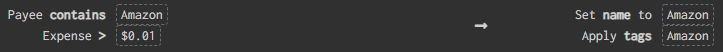

# Lunch Money Amazon Order Matcher

If you order almost everything from Amazon when possible, you know it's hard to categorize your spending in personal finance trackers like Lunch Money. You're either left with a bunch of generic "Shopping" categories, or you have to go through the painstakingly manual process of matching your Amazon orders to transaction amounts.

Lunch Money Amazon Matcher can help!

## How it works

This code will attempt to match Lunch Money Amazon transactions to Amazon orders from your Amazon order history by the total cost of the order (including multi-item orders) within a [date range](https://github.com/Daynil/lunchmoney-amazon-matcher/blob/master/util.ts#L192) of the order date (15 days by default).

If a match is found, a note is set for the Lunch Money transaction which includes the "Category" set by Amazon (e.g. Coffee, Shirt, Pantry Supplies, etc.), as well as a complete discription of the item.

If the matched order is a multi-item order, each item will be listed as above, including the cost of each individual item in the order. If the description exceeds Lunch Money's note length limit (350 characters), and [an algorithm](https://github.com/Daynil/lunchmoney-amazon-matcher/blob/master/util.ts#L58) will intelligently truncate the note for maximum readbility. For example:

_Item 1: $7.51: (SHIRT): Next Level Mens T-Shirt; Item 2: $7.99: (COSMETIC_CASE): Silicone Travel Bottles, Vonpri Leak Proof Squeezable Refillable Travel Accessories Toiletries Containers Travel Size C..._

Now that each Amazon transaction has a detailed description of each order, you can easily categorize them more appropriately!

## Usage

Create a tag in Lunch Money called "Amazon", and create a rule to use whatever logic in Lunch Money you would like to identify Amazon transactions. I use the following rule, but you can modify it to suite your needs:

In order to be kind to Lunch Money's servers, the code will only pull in transactions with this Amazon tag applied, so be sure to apply the rule to all of your historical transactions you would like to use this on.

Get the Amazon tag's ID by clicking one of the tags in your transactions screen. The tag's ID will be displayed as a parameter in the URL:

`https://my.lunchmoney.app/transactions/2021/04?tag=1234`

Clone this repo locally and install dependencies.

`$ npm install`

Create a `.env` file in the base directory. Create 2 environment variables, one called `LUNCHMONEY_ACCESS_TOKEN` and one called `AMAZON_TAG_ID` and set them to the appropriate values.

Go to your Amazon account and [download your order history report](https://www.amazon.com/gp/b2b/reports/) for the time period you'd like to use. Be sure to go back at least 15 days from the starting period of the Lunch Money Amazon transactions you'd like to match (order history has the order date, but the transaction date is the date your card was charged, which can be several days later).

Create a local folder called `order-csv` in the base directory of the code, place your order history there, and name it `amazon_order_details.csv`.

To run the code, open a terminal, navigate to the code's base directory, and run the `match` command. You can run it without arguments to only try matching Lunch Money Amazon transactions for the current month:

`$ npm start -- match`

Alternatively, you can specify a start and end date range, in Lunch Money's date format `YYYY-MM-DD`:

`$ npm start -- match -s "2021-01-01" -e "2021-03-31"`

Lunch Money Amazon Matcher will skip any transactions it could not match to an order, or any transactions that already have a note. A note will be logged detailing what was skipped and why if you would like to try to manually match any of them.

## Known Limitations

Unfortunately, this process isn't perfect due to the nature of interacting between Amazon orders and credit card transactions. Depending on how often the following limitations apply to your Amazon orders, the match rate could range anywhere from 50% to 100%.

- If an Amazon order was payed for with multiple payment methods, or payed with a gift card, the match will fail for that transaction.
  - Gift cards are not linked to Lunch Money, so unless they are manually entered into Lunch Money, any transaction either solely or partly paid with a gift card will not match.
  - Amazon orders paid with multiple payment types (e.g. 2 different credit cards) will have separate transactions in Lunch Money, so they will not match with Amazon order totals.
- 2 different Amazon orders with identical total paid amounts within the same transaction match threshold ([15 day period by default](https://github.com/Daynil/lunchmoney-amazon-matcher/blob/master/util.ts#L192)) cannot be uniquely identified, so they will be skipped.
- If an Amazon order is using an Amazon credit card, paying for part or all of a transaction with credit card rewards points will cause the transaction not to match.
- If an Amazon order had a "coupon" applied, it will not match. Amazon's order export does not account for coupon discounts and only shows item totals, while the Lunch Money transaction would show the amount after the coupon is applied.
- It is theoretically possible for a transaction to be mismatched if two transactions both payed with multiple payment methods and/or partly with reward points and the wrong one added up to the matching amount, though this is probably very unlikely.
